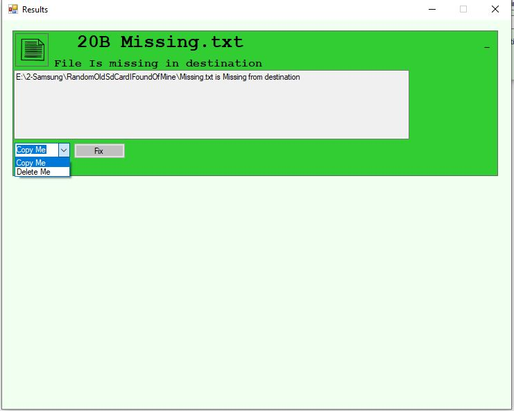

# FolderComparer

Allows you to compare 2 folders or drives to see differences between the files and folders. 

This was made in order to ensure my backup drive and it's redundancy plan, another back up drive were up to date with each other and in synch.

It seems to work fairly well 

# Find difference in files

Select Path Let it run 

Review

## Please note
This was done in this version of .net so it was compatible with mono as all \ majority of the development for this was done on linux meaning visual studio designer for forms will probably not work as all forms and controls where done by hand.

## Complete Guide

 open the open folder dialog by clicking buttons highligthed in red

 Select folder

 by clicking the check contents it will do a md5 hash check on the files this can take a long time with out will just compare size of items in bytes to see diffrences

 then just wait and enjoy, a progress bar buttons will be disabled at this point

 once done you will get a little message box

 you can now review all differences 

 you can click the + in the right hand corner of any of the nodes to see details, directories give you these options

 File missmatches give you these options

 File missing give you these options

## Enjoy

of course goes with out saying this has worked for my purposes feel free to edit it for yours. 

### Legal
This is released under a free to use free to modify (do what you want with the code and images) license. I take no responsiblity for damages or loss\corruption of data.
